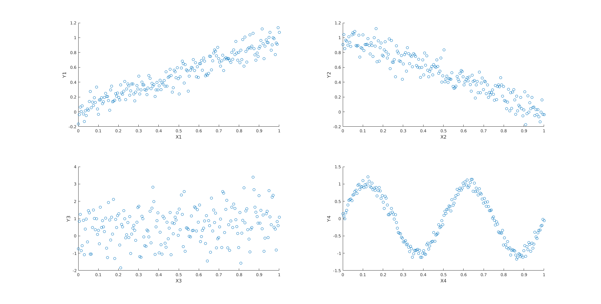

# Machine Learning Assignment 1
This repository contains source for assignment 1 for Machine Learning course by Doctor Hassan Aqeel (CS470).

## Code guide
`main.m` contains code for running the pipeline. The pipeline contains everything. This depends on the following three files:
1. `mcorrelation.m` contains code for computing correlation between two vectors.
2. `mcovariance.m` contains code for comptuting covariance between two vectors.
3. `mcorrcoef.m` contains code for computing correlation coefficient between two vectors.
4. `CorrelationData.mat` has been provided by instructor and will be used in the main pipeline

## Question
Four pairs of vectors are given: (X1,Y1), (X2,Y2), (X3,Y3), (X4,Y4).
1. Plot the four pairs. Then comment on what would you expect as correlation coefficient between them.
2. Compute correlation, covariance and correlation coefficient manually by writing your own functions. Also check correlation coefficient by MATLAB's builtin function corrcoef

### Part (1)

Here are the four plots. As labeled in the figure:



Top left plot shows Y1 vs X1
Top right plot shows Y2 vs X2
Bottom left plot shows Y3 vs X3
Bottom right plot shows Y4 vs X4

In the four given scenarios, we would expect correlation coefficient to be:
1. Positive around 0.8 or 0.9 because y increases as x increases
2. Negative around -0.8 or -0.9 because y decreases as x increases
3. Closer to zero as compared to 1st and 2nd case
4. Close to zero but greater than 3rd case as there is a correlation in the start

### Part (2)

```
Correlation between X1 and Y1
    0.3315

Covariance between X1 and Y1
    0.0812

Correlation coefficient between X1 and Y1
    0.9445

Correlation coefficient (MATLAB) between X1 and Y1
    0.9445

Correlation between X2 and Y2
    0.1717

Covariance between X2 and Y2
   -0.0859

Correlation coefficient between X2 and Y2
   -0.9423

Correlation coefficient (MATLAB) between X2 and Y2
   -0.9423

Correlation between X3 and Y3
    0.3484

Covariance between X3 and Y3
    0.0610

Correlation coefficient between X3 and Y3
    0.2112

Correlation coefficient (MATLAB) between X3 and Y3
    0.2112

Correlation between X4 and Y4
   -0.0891

Covariance between X4 and Y4
   -0.0859

Correlation coefficient between X4 and Y4
   -0.4080

Correlation coefficient (MATLAB) between X4 and Y4
   -0.4080
```

We can see that it is also as expected in the first part.
